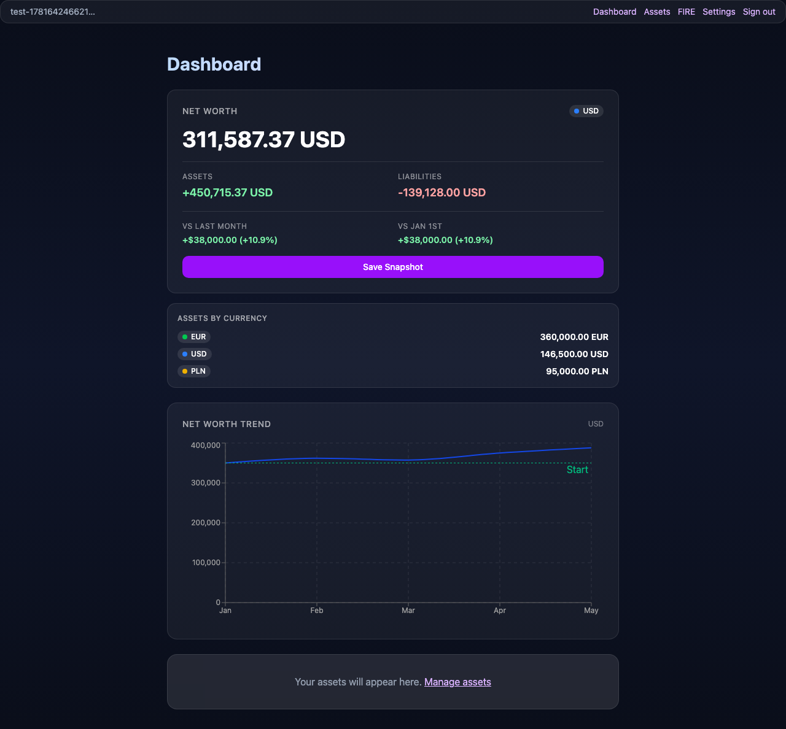
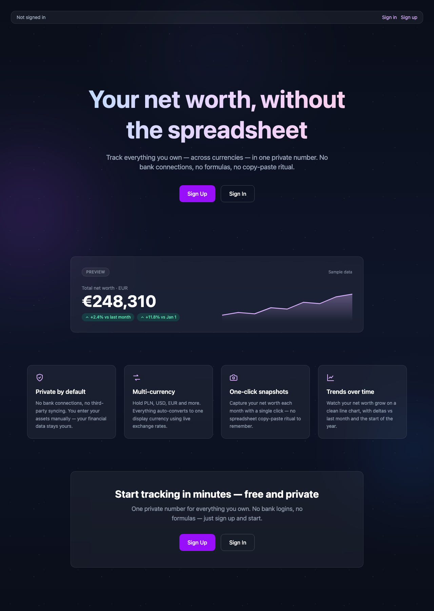
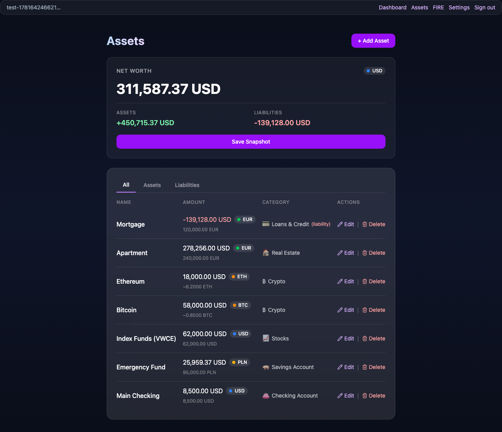
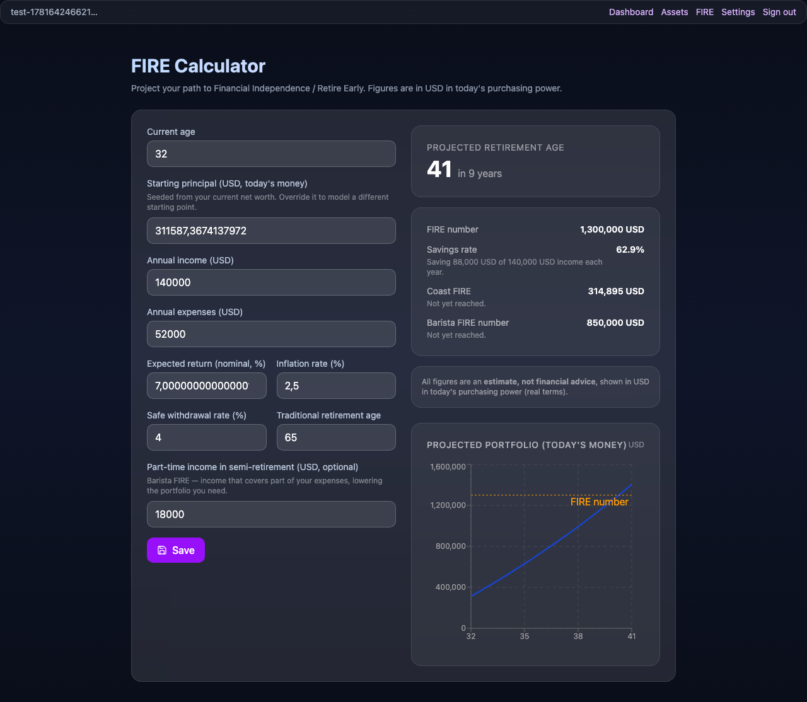
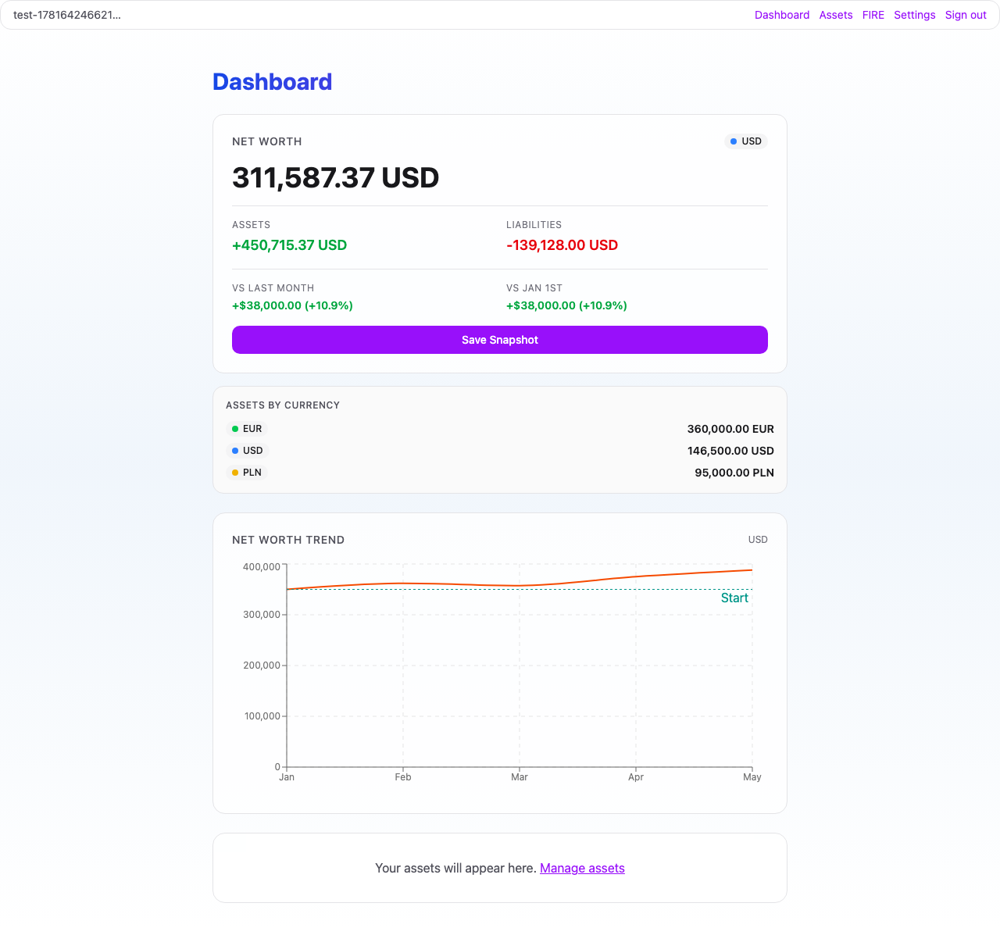
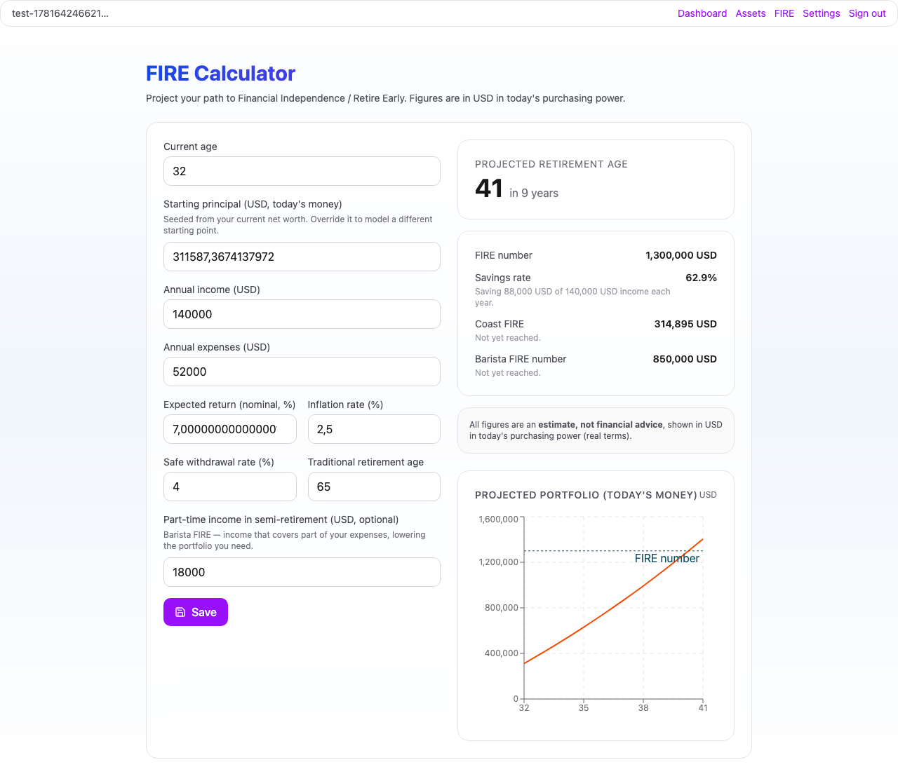
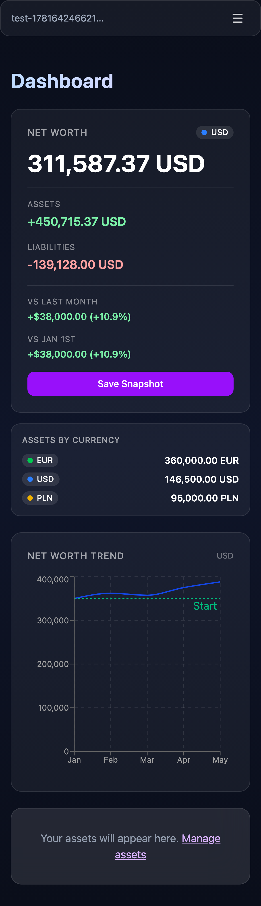
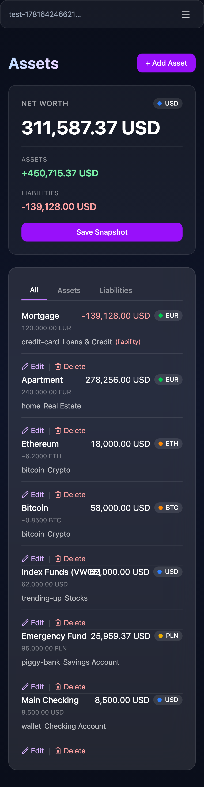
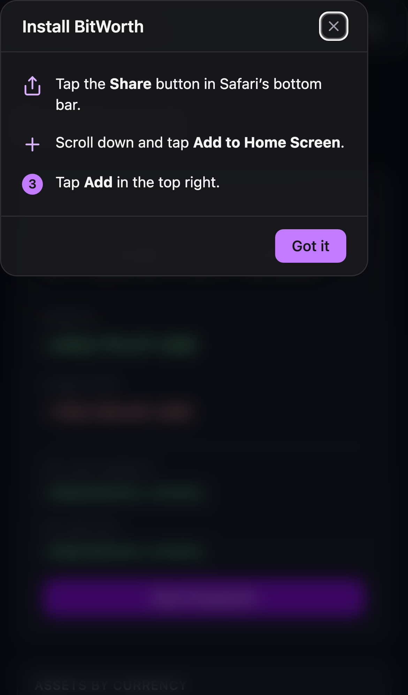

# BitWorth

**Your net worth, without the spreadsheet.**

BitWorth is a privacy-first personal net worth tracker. You manually enter your assets and liabilities across multiple currencies — no bank connections, no data sharing — and BitWorth converts everything to your chosen display currency with live exchange rates, saves monthly snapshots, charts your trend over time, and projects your path to financial independence.

<p>
  
  
  
  
  
  
  
</p>



---

## Why BitWorth

Tracking net worth in a spreadsheet works until it doesn't: formulas drift, currency conversion is manual, and you have no visual history. BitWorth keeps the privacy and control of a spreadsheet while removing the maintenance:

- **Privacy-first** — manual entry only. No bank links, no aggregators, no third-party data sharing. Every row is yours and isolated by row-level security.
- **Multi-currency, automatically** — hold assets in PLN, USD, and EUR; BitWorth converts everything to your display currency using live rates (cached, with graceful fallback).
- **One number, with context** — a single net worth figure plus month-over-month and year-to-date deltas.
- **History you can see** — one-click (and automatic monthly) snapshots feed a trend chart.
- **Plan ahead** — a built-in FIRE calculator projects when you can retire.



## Features

- **Asset & liability tracking** — full CRUD across 13 categories (checking, savings, business, cash, stocks, funds, bonds, crypto, precious metals, real estate, vehicles, loans, P2P). Liabilities subtract from net worth.
- **Net worth calculation** — assets minus liabilities, every currency converted to your display currency, with "vs last month" and "vs Jan 1st" deltas.
- **Snapshots** — save your net worth on demand; the app also auto-saves once per calendar month so your history fills in by itself.
- **Trend chart** — a Recharts line chart over all snapshots, with a "Start" baseline reference line.
- **Live crypto prices** — adding or editing a crypto holding fetches the current market price from CoinGecko (cached, with manual-entry fallback). Top coins are mapped out of the box (BTC, ETH, SOL, and more).
- **FIRE calculator** — enter your income, expenses, return, inflation, and safe withdrawal rate to compute your FIRE number, years to FI, estimated retirement age, plus Coast and Barista FIRE — with a year-by-year projection chart in today's money.
- **Settings** — choose your display currency (PLN/USD/EUR) and theme (light/dark/system), persisted per user.
- **Auth** — email/password authentication via Supabase SSR, with protected dashboard routes.

| Assets                                                                     | FIRE calculator                                                            |
| -------------------------------------------------------------------------- | -------------------------------------------------------------------------- |
| [](docs/screenshots/assets.png) | [](docs/screenshots/fire.png) |

> Screenshots show the default dark theme. BitWorth also ships a light theme (and a "system" option) — here's the dashboard and FIRE calculator in light:
>
> | Dashboard (light)                                                                                       | FIRE (light)                                                                             |
> | ------------------------------------------------------------------------------------------------------- | ---------------------------------------------------------------------------------------- |
> | [](docs/screenshots/dashboard-light.png) | [](docs/screenshots/fire-light.png) |

## Mobile & PWA

BitWorth is a real installable Progressive Web App and is built mobile-first.

<p>
  
  
  
</p>

- **Installable on iOS and Android.** Android/Chrome surfaces a native install button via `beforeinstallprompt` ([`InstallButton.tsx`](src/components/InstallButton.tsx)); iOS Safari gets a dismissible "Add to Home Screen" guide ([`InstallInstructionsModal.tsx`](src/components/InstallInstructionsModal.tsx)).
- **Standalone app shell.** The [web manifest](public/manifest.webmanifest) launches the app at `/dashboard` in `standalone` display mode with a dark theme color and maskable icons (192/512/maskable).
- **Service worker** (Workbox via a custom [Astro integration](src/integrations/pwa.ts)): auto-updates on next navigation; `CacheFirst` for icons, `StaleWhileRevalidate` for hashed `_astro/*` assets; API and Supabase requests always go to the network (never cached).
- **Offline fallback.** Failed navigations fall back to a self-contained [`offline.html`](public/offline.html) shell — no JS, no network calls.
- **Responsive UI.** Tailwind breakpoints throughout; the asset table reflows into cards on narrow viewports (see the mobile assets shot above), and the layout respects safe-area insets for notched devices.

## Tech stack

| Area          | Choice                                     | Version           |
| ------------- | ------------------------------------------ | ----------------- |
| Framework     | Astro (SSR)                                | ^6.3.1            |
| UI islands    | React                                      | ^19.2.6           |
| Language      | TypeScript (strict)                        | ^5.9.3            |
| Styling       | Tailwind CSS (via `@tailwindcss/vite`)     | ^4.2.4            |
| Auth & DB     | Supabase (`@supabase/ssr` / `supabase-js`) | ^0.10.3 / ^2.99.1 |
| Charts        | Recharts                                   | ^3.8.1            |
| UI primitives | Radix UI, Lucide icons                     | ^2.1.16 / ^1.14.0 |
| PWA           | `vite-plugin-pwa` + Workbox                | ^1.3.0            |
| Deployment    | Cloudflare Workers (`@astrojs/cloudflare`) | ^13.5.0           |
| Testing       | Vitest (unit) + Playwright (E2E)           | ^3.2.6 / ^1.60.0  |

## Getting started (local dev)

**Prerequisites**

- Node.js `22.14.0` (see [`.nvmrc`](.nvmrc))
- Docker — required to run the local Supabase stack

**Setup**

```bash
# 1. Install dependencies
npm install

# 2. Start local Supabase (Postgres + Auth + Studio) via Docker
npx supabase start
#    Copies out a SUPABASE_URL (http://127.0.0.1:54321) and an anon key.

# 3. Configure environment — Astro reads .env, Wrangler reads .dev.vars
cp .env.example .env
cp .env.example .dev.vars
#    Fill SUPABASE_URL and SUPABASE_KEY (the anon key from `supabase start`).
#    Optional: COINGECKO_API_KEY (a free Demo key) for reliable crypto prices.

# 4. Generate Supabase types (optional but recommended)
npx astro sync

# 5. Run the dev server
npm run dev
```

The local Supabase instance seeds the 13 asset categories automatically and has email confirmation **disabled**, so you can sign up at `/auth/signup` and use the app immediately.

> Required environment variables: `SUPABASE_URL`, `SUPABASE_KEY`. `COINGECKO_API_KEY` is optional. Both `.env` and `.dev.vars` are gitignored — never commit credentials.

## Scripts

| Command                             | Description                                      |
| ----------------------------------- | ------------------------------------------------ |
| `npm run dev`                       | Start the Astro dev server                       |
| `npm run build`                     | Production build                                 |
| `npm run preview`                   | Preview the production build (serves on `:4321`) |
| `npm run lint` / `npm run lint:fix` | ESLint (with optional auto-fix)                  |
| `npm run typecheck`                 | `tsc --noEmit`                                   |
| `npm run format`                    | Prettier write                                   |
| `npm run test` / `npm run test:run` | Vitest (watch / single run)                      |
| `npm run test:e2e`                  | Playwright E2E tests                             |

## Project structure

```
src/
  pages/              Astro routes (landing, auth, dashboard, API endpoints)
    api/              Server routes: assets, snapshots, categories, rates, crypto-price, user-preferences, auth
    dashboard/        Dashboard, assets, FIRE, settings pages
  components/         React islands + Astro components (assets/, fire/, settings/, Install*, NetWorthChart…)
  lib/                Pure business logic: net-worth, fire, exchange-rates, crypto-prices, supabase
  layouts/            Layout + DashboardLayout (SW registration, head tags, safe-area)
  integrations/pwa.ts Custom Astro integration wrapping vite-plugin-pwa
  middleware.ts       Auth gate for protected routes + preference loading
supabase/
  migrations/         Schema, RLS policies, crypto/FIRE columns
  seed.sql            13 asset categories
e2e/                  Playwright tests + screenshot capture utility
public/               manifest.webmanifest, offline.html, icons/
```

## Architecture notes

- **Astro SSR + React islands.** Pages fetch data server-side; interactive pieces (forms, charts, install UI) hydrate as React islands.
- **Auth in middleware.** [`src/middleware.ts`](src/middleware.ts) gates protected routes and loads user preferences (display currency, theme) into `Astro.locals` for every request.
- **Pure logic in `src/lib/`.** [`net-worth.ts`](src/lib/net-worth.ts), [`fire.ts`](src/lib/fire.ts), [`exchange-rates.ts`](src/lib/exchange-rates.ts), and [`crypto-prices.ts`](src/lib/crypto-prices.ts) keep calculations testable and side-effect free.
- **Resilient external calls.** Exchange-rate and crypto-price fetches cache results and fall back gracefully, so the UI never breaks when an upstream API is down or rate-limited.
- **Row-level security.** Every user-owned table is RLS-isolated; users can only read and write their own rows.
- **Consistent error shape.** API routes always return `{ error: { code, message, context? } }`.

## Deployment

BitWorth deploys to **Cloudflare Workers** via the `@astrojs/cloudflare` adapter and Wrangler. Production needs both runtime secrets (`wrangler secret put SUPABASE_URL/SUPABASE_KEY`) and the same values set as Build environment variables in the Cloudflare dashboard (the Workers Builds pipeline reads those). See [`CLAUDE.md`](CLAUDE.md) for the full two-step setup.

## Regenerating screenshots

The images in `docs/screenshots/` are generated by a Playwright utility that seeds a throwaway demo account (realistic multi-currency assets, backdated monthly snapshots, FIRE inputs) in your **local** Supabase and captures desktop + mobile views (dark theme as primary, plus a couple of light-theme shots):

```bash
npx supabase start
export $(grep -v '^#' .env | xargs)   # SUPABASE_URL + SUPABASE_KEY
npm run build && npm run preview        # serves on :4321
npx playwright test e2e/capture-screenshots.spec.ts
```

See [`e2e/capture-screenshots.spec.ts`](e2e/capture-screenshots.spec.ts) for the seed data and capture steps.

---

Built as a 10xDevs project.
